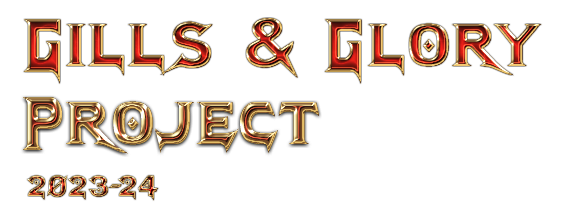

# Real Time Startegy Game

## Overview

This project is to make real time strategy (RTS) game similar to "Command & Conquer" series
its made in Visual Studio using the SFML Library.

Player has the ability to build buildings each building has its own specific unit type 
that can be created such as 
Barracks -> infantry type -> Rifleman
WarFactory -> vehicles type -> Tanks
AirCraft -> Air type -> Helicopter

Enemy - enemy is on the other side of the map its goal is to destroy the players buildings,
it builds buildings and units and sends them to explore the map, group up and attack the player.

WIN/LOSE condition - whoever loses all buildings wins

level Editor:

Player can create there own map, there is tiles that the user can pick and click on the map to place it down,
rotate the tile and when finished you can save/load the map.
There are 4 type of tiles 
Walkables -> units should be able to travel on, all ground tiles
Walls -> units cant go across, except air units they are special
Resource -> resource tiles, this is how the player gets money
Misc -> these are more decorations such as weed (plant) behave same as Walkables

### License

This project is licensed under the GNU GENERAL PUBLIC LICENSE 

[License](LICENSE.txt)